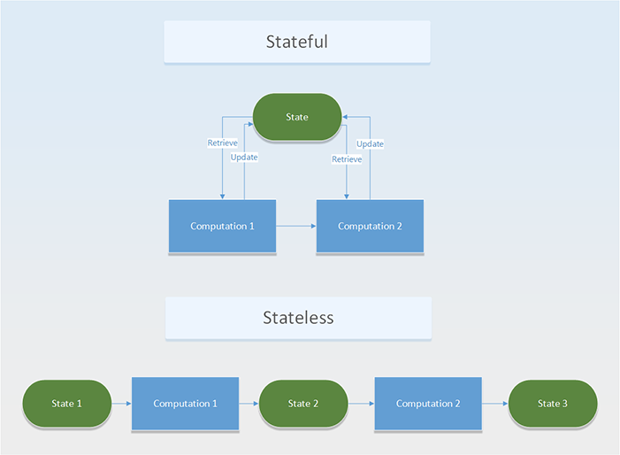
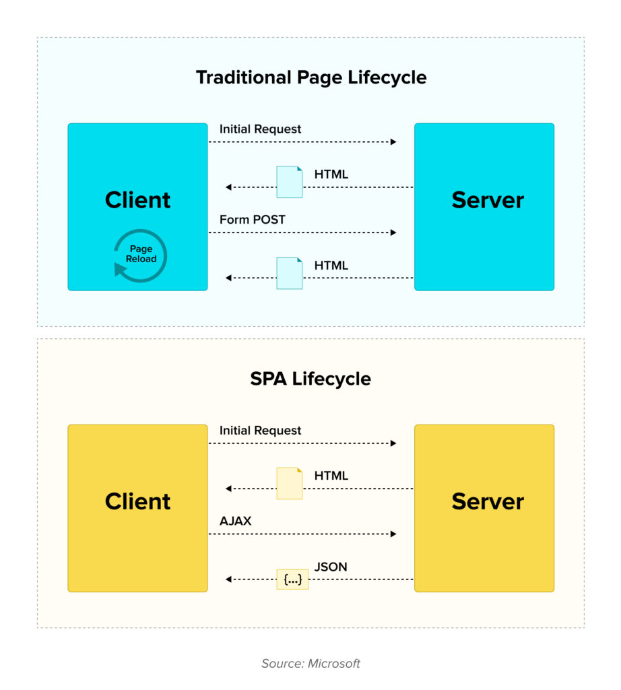

# 1 为什么`第一方`和`第三方`Cookie不同对待？

- 第一方 Cookie 是你直接访问的域名，它允许网站的拥有者可以搜集分析数据，记住语言设置或者提供很好的用户体验。举例来讲，在你访问社交网站的时候，你并不需要每次都需要重复登陆操作。
- 第三方 Cookie 并不是你正在访问的网站创建的，它通常是由第三方网站创建，用在跨站追踪上或者广告投放。举例来将，在正在浏览的网页上添加一个不可见的元素，浏览器用来向第三方网站发送请求。

```html
<a href="ad.doubleclick.net/some-other-parameters-specific-to-this-ad" target="_blank" rel="noopener"></a>
```

毫无疑问，第一方 Cookie 是互联网用户体验的重要的一部分；但是第三方 Cookie 通常涉及到用户的隐私数据的使用，现在的浏览器一般都可以配置竞争使用第三方 Cookie。


# 2 为什么我们通常在无状态服务做出巨大的付出，那么在无状态代码中有哪些好处以及有状态有什么坏处？

无状态的服务通常是不需要存储客户端生成的数据，这些数据通常是用在用户会话的 `session` 中；而有状态的服务缺恰恰相反。


为什么我们需要无状态的服务呢？
- 使用有状态的服务需要与存储层创建链接，这个增加工作量。
- 在有状态的服务中，需要在每次请求的时候维持事务操作。
- 需要处理用户数据存储等各种情况。

使用无状态服务可以获得如下的好处
1. 使用无状态的服务，可以很容易的扩展它们，只需要增加需要部署的服务。
2. 无状态的服务可以很方便的时候缓存。
3. 避免的存储层的设计。
4. 在每个请求中，无需绑定客户端和服务端，可以做到流水线处理。


现在很多云服务提供商提供了无状态服务 [Function as a Service](https://en.wikipedia.org/wiki/Function_as_a_service) (FaaS)，比如 AWS 的 Lambda, Azure 的 Function.


# 3 从后端的角度来看，采取单页面应用程序(`Single Page Application`)有什么弊端和缺陷？

首先，什么是单页面应用程序呢？从字面上讲，就是的单个页面持续和用户交互并且动态地重写当前页面而不是重新加载新的页面。

单页面应用程序地工作流程是这样的，在浏览器第一次打开的时候，服务端返回HTML页面，但是在后续的请求中，只会返回 JSON 数据结构。单页面和多页面应用程序的区别如下。



单页面应用程序只会重写当前页面的内容，这样就不用页面加载和额外的等待时间。
单页面应用程序有下面的好处
- 快速的响应时间：因为没有额外的页面加载，所以响应时间就很快。
- 无缝的用户体验：单页面应用程序使用体验和桌面和移动程序一样。只需要看到页面改变即可。
- 构建富特色的应用程序：通过单页面应用程序，可以构建内容编辑的Web应用和实时分析，如果用传统的方式就需要不同的加载页面。
- 使用更小的带宽：由于单页面应用程序，不需要额外的数据传输，减少了数据在网络中的传输。

单页面应用的缺陷：
- SEO处理不够友好：大部分搜索引擎的度量标准是这个站点有多少页面，有于单页面应用只有一个页面，所以不能很好的做到优化。
- 使用了大量的浏览器资源：在单页面应用程序中，大部分任务都是由浏览器完成，所以浏览器会使用很多资源。