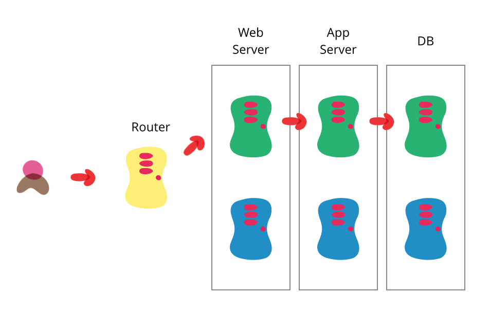

## 1 ACID通常是 `Atomicity`, `Consistency`，`Isolation` 和 `Durabiltiy`。这四个属性通常有数据库引擎的事务来保证，你能谈谈这个话题吗？

数据库通过事务来保证数据的完全性，通常用 `ACID` 来表示。

- **Atomicity**

不同于多线程变种原子操作，数据库中的 `Atomicity` 描述了下述的情况，如果客户端打算执行若干次写操作，但是由于某种原因，其中的有部分操作失败了。如果这些操作被组合成一个事务（transaction），那么数据库丢弃掉这些操作，数据库并不会生成 `脏` 数据。这样很方便进行重试操作。

- **Consistency** 

对于数据库中，你可以声明一些一定正确的语句。比如说对于财务的数据，所有账户的财务数据是平衡的。当然这个通常也取决于应用程序，如果刻意写入不合法的数据，数据库也不能阻止其发生。但是有些数据库会对写入的数据会做一些校验，比如日期字段合法性。

- **Isolation**

通常一个数据库被会多个客户端同时访问，如果都是读取或者修改不同的部分没有什么问题，但是如果同时修改的相同的部分，就会导致类似条件竞争的情况发生。数据库的 `Isolation` 意味着并发执行的事务是各自独立的，通常也叫做序列化。但是在实际中很少会使用序列化来完成 `Isolation`，因为有性能方面的损失。

- **Durability**

`Durability` 是一种数据库中一种承诺，一旦事务成功完成，那么它写入的数据就不会忘记。


## 2 什么叫做`Blue-Green Deployment`

`Blue-Green Deployment` 是一种减少服务宕机时间和避免 regression 的方法，它提供了两套一摸一样的生产环境，分别称之为 `Blue` 和 `Green`。



在任何时刻，只有一个环境是工作的，它承载的所有生产环境中的流量，而另一个环境则处于闲置状态。比如上图中，绿色的部分为工作环境，而蓝色部分处于闲置状态。

当你为软件开发出新的版本，在闲置的环境中部署，并且执行完全部的测试，比如在蓝色的环境中完成这些工作。然后在路由中切换所有的流量到新部署的环境中，那么现在绿色部分的环境就变为闲置。

这样做减少了宕机的时间，而且降低了风险，因为一旦新的软件版本出现问题，可以立马将路由切回到原来的环境，完成回滚。

这个设计通常要保证 `Green` 和 `Blue` 两套环境一摸一样，而且使用同一份数据。这样对于数据库的设计提出了挑战，尤其是在新的软件版本中需要修改数据库的 schema，因为一旦 rollback 就会导致不同版本之间的兼容性，解决办法就是将数据库升级和软件升级区分开来。

## 3 什么是 `N + 1` 问题 

N+1 问题通常是在使用 ORM 的时候发生，尤其是在使用懒加载的时候。当一个应用程序从数据库中获取了数据，然后迭代这个这个结果。这就意味着我么一遍遍的访问数据库。最终这个应用程序会在处理结果的每一行都有一个查询操作（N）和最原始的依次查询 （+1）。这就是 N+1 问题。
我们以 C# 中广泛使用的 Entity Framework 为例

```C#
using (var context = new StackOverFlowContext())
{
    var posts = context.Posts
                .Where(t => t.PostTags.Any(pt => pt.Tag == "sqlbulkcopy"))
                .Select(p => p);
    foreach(var post in posts)
    {
        foreach(var linkPost in post.LinkedPosts)
        {
            // Do something important.
        }
    }
}
```

上面的代码生成的 SQL 代码如下

```sql
Select
    [Extent1].[Id] as [Id],
    [Extent1].[TagVarchar] AS [TagsVarchar]
    FROM [dbo].[Posts] AS [Extent1]
    Where Exists (Select 
        1 as [C1]
        From [dbo].[PostTag] as [Extent2]
        Where ([Extent1].[Id] = [Extent2].[PostId]) And (N'sqlbulkcopy' = [EXtent2].[Tag]))
```

在这个例子中，我们从 Posts 表和 PostTags 表中获取 Tags 等于 `sqlbulkcopy`， 问题出在下面这么一行代码

```C#
foreach (var linkPost in post.LinkedPosts)
```

原因是原先的查询并由从 `LinkedPost` 实体中获取数据，仅仅从 `Posts` 和  `PostTags`。 Entity Framework 知道它没有从 `LinkedPosts` 实体中获取数据，所以会自动在每一行中自动从数据库中查询。这个糟糕透了，因为我们知道多次查询肯定比依次查询慢。

那么该如何解决这个问题呢？很简单只需要使用 `Include` 方法即可，也叫做激进加载。使用 `Include` 可以将所有的 `LinkedPosts` 实体加载进来。

```C# 
var posts = context.Posts
            .Where(t => t.PostTags.Any(pt => pt.Tag == "sqlbulkcopy"))
            .Include(p => p.LinkedPosts)
            .Select(p => p);
```

在这里，当 LinkedPosts 实体被访问的时候，Posts 实体已经加载了全部的数据，这样就不在需要额外的数据库访问。
那么我们生成的 SQL 语句有

```sql
SELECT 
    [Project2].[Id] AS [Id], 
    /* All columns from the Post table are in the SELECT. Extra columns removed for brevity */
    [Project2].[LinkTypeId] AS [LinkTypeId]
    FROM ( SELECT 
        [Extent1].[Id] AS [Id], 
        /* All columns from the Post table are in the SELECT. Extra columns removed for brevity */
        [Extent1].[TagsVarchar] AS [TagsVarchar], 
        [Extent2].[Id] AS [Id1], 
        [Extent2].[CreationDate] AS [CreationDate1], 
        [Extent2].[PostId] AS [PostId], 
        [Extent2].[RelatedPostId] AS [RelatedPostId], 
        [Extent2].[LinkTypeId] AS [LinkTypeId], 
        CASE WHEN ([Extent2].[Id] IS NULL) THEN CAST(NULL AS int) ELSE 1 END AS [C1]
        FROM  [dbo].[Posts] AS [Extent1]
        LEFT OUTER JOIN [dbo].[PostLinks] AS [Extent2] ON [Extent1].[Id] = [Extent2].[PostId]
        WHERE  EXISTS (SELECT 
            1 AS [C1]
            FROM [dbo].[PostTags] AS [Extent3]
            WHERE ([Extent1].[Id] = [Extent3].[PostId]) AND (N'sqlbulkcopy' = [Extent3].[Tag])
        )
    )  AS [Project2]
    ORDER BY [Project2].[Id] ASC, [Project2].[C1] ASC
```