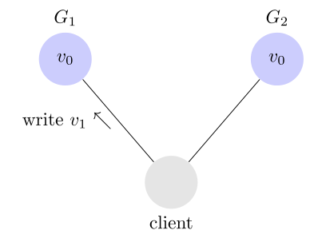
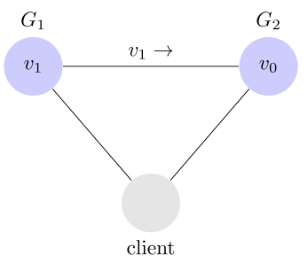

- `Brewer`理论，也叫做`CAP`理论，说明在网络分区（network Partition)中，一个系统设计者需要在以一致性`Consistency`和可用性`Availiablity`中做出选择，你能举出`CP`， `AP`和`CA`系统的例子吗？

### 什么是 CAP 理论

一个分布式系统有三个指标 
    - Consistency
    - Availability
    - Partition Tolerance

它们的第一个字母是 C，A，P。所以也叫做 CAP 理论。
首先第一个叫做 `Partition Tolerance`，也就是分区容错。大部分分布式系统分布在多个子网络中，每个子网络也叫做一个区。分区容错表明区间通信可能失败。

G1 和 G2 是两台跨区的服务器，当 G1 向 G2 发送消息的时候，G2 可能无法收到，系统设计的时候，必须考虑到这种情况。

第二个叫做 `Consistency`, 也叫做一致性，意思就是写操作之后，进行都操作，必去返回该值。假设用户某条记录是 v0, 用户向 G1 发起写操作，将其修改为 v1

接下来用户的读操作就会得到 v1，叫做一致性。问题是，用户可能向 G2 发起读操作，由于 G2 的值没有发生变化，因此返回的仍然是 v0。那么 G1 和 G2 的读操作不一致了，这就不满足了一致性。

为了让 G2 也能够变为 V， 就要在写 G1 写操作的时候，让 G1 向 G2 发送一条消息，要求将 G2 也改成 v1

这样用户可以向 G2 发起读操作，也能得到 v1。

最后一个是 `Availability`, 中文叫做可用性。意思就是只要收到用户的请求，服务器就必须给出回应。不管是 G1 或者 G2 的发起读操作，只要收到请求，必须告诉做出响应。

### Consistency 和 Availability 的矛盾

一致性和可用性不能同时成立，因为可能出现分区通信失败。如果保证 G2 的一致性，那么 G1 在写操作的时候，锁定 G2 的读操作和写操作。只有数据同步完毕后才能重新开发读写。在锁定期间，G2 没有可用性。同样如果保证 G2 的可用性，则不能锁定 G2， 一致性不成立。

- 在 AP 分布式系统中，我们更加青睐于 `Availability` 和 `Partition Tolerancy`，比如 Web 缓存，以及 DNS 系统。
- 在 CP 系统中，我们更加期待一致性，比如分布式锁协议。