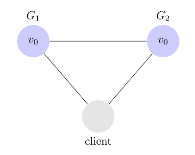

## 1 `Brewer`理论，也叫做`CAP`理论，说明在网络分区（network Partition)中，一个系统设计者需要在以一致性`Consistency`和可用性`Availability`中做出选择，你能举出`CP`， `AP`和`CA`系统的例子吗？

**什么是 CAP 理论**

一个分布式系统有三个指标 
    - Consistency
    - Availability
    - Partition Tolerance

它们的第一个字母是 C，A，P。所以也叫做 CAP 理论。
首先第一个叫做 `Partition Tolerance`，也就是分区容错。大部分分布式系统分布在多个子网络中，每个子网络也叫做一个区。分区容错表明区间通信可能失败。

G1 和 G2 是两台跨区的服务器，当 G1 向 G2 发送消息的时候，G2 可能无法收到，系统设计的时候，必须考虑到这种情况。

第二个叫做 `Consistency`, 也叫做一致性，意思就是写操作之后，进行都操作，必去返回该值。假设用户某条记录是 v0, 用户向 G1 发起写操作，将其修改为 v1

接下来用户的读操作就会得到 v1，叫做一致性。问题是，用户可能向 G2 发起读操作，由于 G2 的值没有发生变化，因此返回的仍然是 v0。那么 G1 和 G2 的读操作不一致了，这就不满足了一致性。

为了让 G2 也能够变为 V， 就要在写 G1 写操作的时候，让 G1 向 G2 发送一条消息，要求将 G2 也改成 v1

这样用户可以向 G2 发起读操作，也能得到 v1。

最后一个是 `Availability`, 中文叫做可用性。意思就是只要收到用户的请求，服务器就必须给出回应。不管是 G1 或者 G2 的发起读操作，只要收到请求，必须告诉做出响应。

** Consistency 和 Availability 的矛盾**

一致性和可用性不能同时成立，因为可能出现分区通信失败。如果保证 G2 的一致性，那么 G1 在写操作的时候，锁定 G2 的读操作和写操作。只有数据同步完毕后才能重新开发读写。在锁定期间，G2 没有可用性。同样如果保证 G2 的可用性，则不能锁定 G2， 一致性不成立。

- 在 AP 分布式系统中，我们更加青睐于 `Availability` 和 `Partition Tolerancy`，比如 Web 缓存，以及 DNS 系统。
- 在 CP 系统中，我们更加期待一致性，比如分布式锁协议。

## 2 你能解释一下最近对`NoSQL`热度越来越高的原因吗？

`NoSQL` 通常是指 `Not Only SQL`, 它将非结构化，缺少 Schema 的数据存储在不同的集合或者节点中，因此它不需要固定的表结构，支持有限的 Join 查询，但是可以支持水平化扩展。`NoSQL` 越来越流行的原因主要有下面几点：

- 高扩展性：传统的关系型数据库在需要提高性能的时候只能垂直扩展，也就是只能购买更昂贵的机器。但是 `NoSQL` 只需要购买相同的机器进行横向扩展即可。

- 低维护成本：高性能的关系型数据库维护非常费人力资源，但是 `NoSQL` 并不需要这么多的人力资源，因为它包含了很多功能比如：自动修复，数据分布和更简单的数据模型以方便管理员管理。而且大部分 `NoSQL` 都是免费并且开源，而且 `NoSQL` 可以运行在非常便宜的硬件机器上。

- 无特定的 Schema 和固定的数据模型：数据插入 `NoSQL` 并不需要任何预定义的 schema。而且数据的格式和模型可以随时修改，而不用担心破坏正在运行的程序，而修改数据的 Schema 在 SQL 中是一个头疼的事情。

- 支持缓存：`NoSQL` 支持使用系统内存作为缓存以便提高系统的吞吐量。

## 3 在那种情况下你会选择文档型数据库比如`MongoDB`而不是关系型数据库比如`MySQL`?

为了避免数据库成为系统的瓶颈，尤其是高并发的环境，`NoSQL` 是一种比 `MySQL` 更好的一种选择。

1. 存储大量没有结构的数据。MongoDB 这种数据库并没有限制存储数据的结构，而且随着业务的需要随着可以修改数据结构。

2. 使用云计算和存储。云存储是一个很好的解决方案，但是它需要很容易的将数组传递到全球。使用可接受的硬件存储是重要的决策依据。

3. 快速开发的能力：如果想要敏捷开发整个软件或者服务，`NoSQL` 对于关系型数据库并不需要很严格的准备工作。

## 4 什么叫最终一致性（Eventual  Consistency)?

最终一致性是一致性模型，主要用在分布式计算中用来达到高可用性。如果给定的数据项没有新的更新，最终所有访问这个数据项的请求都会返回相同的结果。最终一致性也叫做乐观备份。
如果一个系统实现了最终一致性，那么也叫做 coverage. 最终一致性也是一种弱保证。对于实现最终一致性的服务也叫做 BASE （Basically Available， Soft State, Eventual consistency)，它是传统的 ACID 的对立面。
- Basic Available: 基础的读写操作基本上极可能的满足，但是没有任何一致性保证
- Soft State: 没有一致性保证，但是经过一段时间后，我们只有一定的概率知道它的状态。
- Eventual Consistency: 如果系统还在工作，经过一段时间后等待后，我们就能知道数据库的状态，并且读操作的返回都是符合预期的。

## 5 为什么NoSQL解决了可扩展性的挑战？

*todo*
