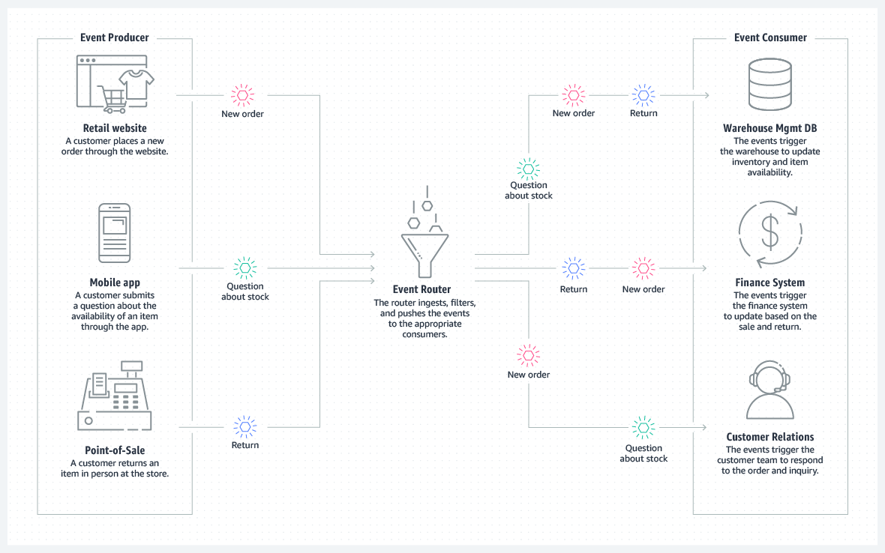

1. [什么时候缓存是无用的，甚至是危险的？](#1-shen-me-shi-hou-huan-cun-shi-wu-yong-de-shen-zhi-shi-wei-xian-de)
2. [为什么事件驱动架构提高可靠性？](#2-wei-shen-me-shi-jian-qu-dong-jia-gou-ti-gao-ke-kao-xing)
3. [如何让代码可读？](#3-ru-he-rang-dai-ma-ke-du)
4. [紧急设计(Emergent Design)和演化架构(Evolutionary Architecture)之间的区别是什么？](#4-jin-ji-she-ji-emergent-design-he-yan-hua-jia-gou-evolutionary-architecture-zhi-jian-de-qu-bie-shi-shen-me)
5. [横向扩展和纵向扩展有什么区别？什么时候使用其中一个，而不是另外一个？](#5-heng-xiang-kuo-zhan-he-zong-xiang-kuo-zhan-you-shen-me-qu-bie-shen-me-shi-hou-shi-yong-qi-zhong-yi-ge-er-bu-shi-ling-wai-yi-ge)
6. [如何处理"故障切换(failover)"和"用户会话(user session)"？](#6-ru-he-chu-li-gu-zhang-qie-huan-failover-he-yong-hu-hui-hua-user-session)
7. [什么是CQRS（Command Query Responsibility Segregation)? 它和最初的有什么区别？](#7-shen-me-shi-cqrscommand-query-responsibility-segregation-ta-he-zui-chu-de-you-shen-me-qu-bie)

## 1 什么时候缓存是无用的，甚至是危险的？
*todo*

## 2 为什么事件驱动架构提高可靠性？
事件驱动的架构使用事件来触发和通信各个服务组件， 一个事件可以是状态的改变或者更新，事件即可以是包含状态信息也可以只是一个标识符。一个事件驱动的架构主要有三个重要的组件：事件的生产者，事件的路由和事件的消费者。事件的生产者发布事件到路由，路由包含了过滤器然后将这些事件推送到消费者那边。这样生产者的消费者就解耦了，允许它们各自独立扩容，更新和部署。

使用这个架构的好处是

1. 扩容和宕机是独立
通过解耦服务，让它们只知道事件路由器，而不知道彼此的存在，这就意味着你们的服务是互操作的。但是如果一个服务宕机，剩下的服务仍然可以继续运行。

2. 开发的敏捷性
这也就意味你没有必要再编写代码来 poll, 过滤和路由事件。事件路由自动的过滤和推送事件到消费端，而且它还起初了服务的生产者和消费者之间的同步问题，可以加速开的的流程。

3. 审计更加容易

一个事件路由充当了中心化的角色，可以通过它来审计应用程序和策略。这些策略可以用来限制谁可以推送和订阅事件路由，为数据的访问增加权限控制。

4. 降低成本

事件驱动是基于推送的，所以每一件事都是基于改变才会进行的。通过这种方式，你可以不必要为持续的查询 （poll) 检查事件来付费。这也就意味着更少的网络带宽，更少的 CPU 使用，更少的 SSL/TSL 的握手请求。

## 3 如何让代码可读？
*todo*

## 4 紧急设计(Emergent Design)和演化架构(Evolutionary Architecture)之间的区别是什么？
*todo*

## 5 横向扩展和纵向扩展有什么区别？什么时候使用其中一个，而不是另外一个？

当你的应用由于请求量的增加，需要增加计算资源以便能够处理这些请求。这时你有两种方式方法来完成这个目标：1）横向扩展(`Scale Up`)；2）纵向扩展(`Scale Out`)，它们可以用下面这张图来表示

1. 纵向扩展类似购买性能更加强劲的服务器，比如更快的 CPU，更大的内存等等，这样就能处理大流量请求。
2. 横向扩展类似购买更多的普通的机器，将它们作为一个集群来处理大流量请求。

那么我们一般怎么去选择相应的扩展方式呢？

- 性能：由于横向扩展只要堆积机器即可，理论上来讲可以达到很高的性能表现；但是对于纵向拓展，单台机器的硬件配置是有限的，当我们达到工业界的临界值的时候，就无法再继续扩展；
- 灵活性：如果你的系统原本就是为单点设计的，那么使用纵向扩展就非常容易，代价最小。如果你想灵活的配置启动设置，并且优化成本和性能，可以选择横向拓展
- 系统升级：如果你的系统升级比较频繁，那么单点机器的话就比较困难，几乎不可能有宕机的时间；但是对于水平扩展的机器就没有这个问题。
- 冗余性：横向扩展的的系统可以很好的避免单点故障这个问题。
- 地理分布：如果你的系统是分布在全球以减低延迟，避免自然灾害等等，那么使用横向扩展是一个最好的选择，没有任何理由将系统放在一台机器上。
- 成本：越来越多的多核高性能机器上市，而且也非常便宜。如果单个机器也能满足你的需求，可以尝试使用纵向拓展的方式。

## 6 如何处理"故障切换(failover)"和"用户会话(user session)"？
*todo*
## 7 什么是CQRS（Command Query Responsibility Segregation)? 它和最初的有什么区别？

`Command Query Responsibility Segregation` 是一种特定的架构模式，用来解决应用程序设计中的一种场景的情形。

假设我们有一个电子商务的网站，或许会有一个 `Order` 这样一个实体和 `OrderRepository`
