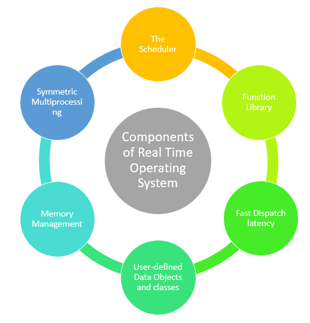
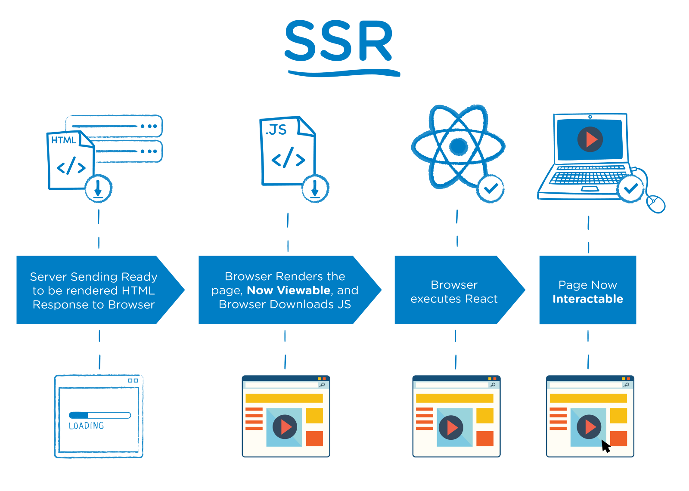

1. [函数式语言是做什么的？什么时候我们需要使用函数语言？](#1-han-shu-shi-yu-yan-shi-zuo-shen-me-de-shen-me-shi-hou-wo-men-xu-yao-shi-yong-han-shu-yu-yan)
2. [Microsoft，Google，Opera和Mozilla公司从他们的浏览器中如何获利的？](#2-microsoftgoogleopera-he-mozilla-gong-si-cong-ta-men-de-liu-lan-qi-zhong-ru-he-huo-li-de)
3. [为什么打开TCP套接字有很大的开销？](#3-wei-shen-me-da-kai-tcp-tao-jie-zi-you-hen-da-de-kai-xiao)
4. [封装对于那些有重要的作用？](#4-feng-zhuang-dui-yu-na-xie-you-zhong-yao-de-zuo-yong)
5. [什么是实时系统？它和普通的系统有什么区别？](#5-shen-me-shi-shi-shi-xi-tong-ta-he-pu-tong-de-xi-tong-you-shen-me-qu-bie)
6. [实时语言(real-time language)和堆内存分配(heap memory allocation)之间的关系是什么？](#6-shi-shi-yu-yan-realtime-language-he-dui-nei-cun-fen-pei-heap-memory-allocation-zhi-jian-de-guan-xi-shi-shen-me)
7. [不可变性是怎么帮助我们提高编写更安全的代码？](#7-bu-ke-bian-xing-shi-zen-me-bang-zhu-wo-men-ti-gao-bian-xie-geng-an-quan-de-dai-ma)
8. [可变性变量和不可变量有什么优势和弊端？](#8-ke-bian-xing-bian-liang-he-bu-ke-bian-liang-you-shen-me-you-shi-he-bi-duan)
9. [什么是O/R阻抗失衡(Object-Relational impedence mismatch)？](#9-shen-me-shi-or-zu-kang-shi-heng-objectrelational-impedence-mismatch)
10. [缓存大小在设计的时候需要考虑哪些原则？](#10-huan-cun-da-xiao-zai-she-ji-de-shi-hou-xu-yao-kao-lv-na-xie-yuan-ze)
11. [客户端渲染和服务端渲染有什么各自弊端，如何取舍？](#11-ke-hu-duan-xuan-ran-he-fu-wu-duan-xuan-ran-you-shen-me-ge-zi-bi-duan-ru-he-qu-she)
12. [如何在不可靠的协议上开发出可靠通讯协议？](#12-ru-he-zai-bu-ke-kao-de-xie-yi-shang-kai-fa-chu-ke-kao-tong-xun-xie-yi)
13. [想象一下如果在你最喜欢的语言移除空引用的问题，你该如何做？会导致什么样的后果？](#13-xiang-xiang-yi-xia-ru-guo-zai-ni-zui-xi-huan-de-yu-yan-yi-chu-kong-yin-yong-de-wen-ti-ni-gai-ru-he-zuo-hui-dao-zhi-shen-me-yang-de-hou-guo)

## 1 函数式语言是做什么的？什么时候我们需要使用函数语言？
函数式语言是一种编程范式，在函数式语言程序是由调用和组合函数而成。这是一种声明式编程式编程语言，是由一系列表达式构成的树组成，通常将一些值转换成其他值。
在函数式编程中，函数被认为是第一等公民，也就意味着它可以和一个变量绑定，作为参数传递到其他函数中，或者从其他函数中返回。
当在函数式语言中，如果所有的函数都是类似数学函数，或者纯函数，也就是说对于任何相同的输入，它的返回值都是一样的，而不会影响任何其他可变的状态或者有其他副作用，那么我们可以叫做纯函数编程。纯函数编程通常有更少的 bug, 非常容易调试和测试。

函数式语言起源于学术界，因此它非常它在编程语言理论研究中广泛应用。函数式语言特别适用于一些对于同一个数据集进行多次操作的场景中，比如机器学习。函数式语言在金融领域的风险控制中也广泛使用，因为每个函数都可以看做关系图中的一个节点。
## 2 Microsoft，Google，Opera和Mozilla公司从他们的浏览器中如何获利的？

在上个世纪的 90 年代，网景公司（netscape）发布一款浏览器叫做 `Netscape Navigator`，该软件风靡全球。这时微软觉得这款软件威胁到 `Windows` 在桌面操作系统的统治地位。于是微软开发出了自己的浏览器 `Internet Explorer`，该软件拥有和 `Netscape Navigator` 同样的功能，最致命的是该软件采用的免费的策略，可以和 `Windows` 操作系统深度绑定。因此在这场浏览器大战中，微软的 `IE` 浏览器笑到了最后。虽然微软没有从浏览器中没有挣到钱，但是通过与 `Windows` 系统深度绑定免费策略，巩固了微软在桌面领域的统治地位。

在微软赢得浏览器大战之后，并没有将更多的资源放在浏览器上。在网景公司倒闭后，成立了 Mozilla 公司，在 2004 年发布了 `firefox` 浏览器。由于插件的机制，该浏览器受欢迎的程度在 2009 年就超过了 `IE` 浏览器。那么 Mozilla 是如何通过浏览器盈利的呢？通过该公司的年度财报我们可以发现其 `95%` 的收益来自于特许权，主要是 `firefox` 浏览器的默认搜索引擎的设置。在 `2014` 年之前，`Mizilla` 于 `google` 达成协议，使用 `google` 作为默认搜索引擎；在 `2014` 到 `2017`, 于 `Yahoo` 达成协议，切换为 `Yahoo` 的搜索引擎；后来继续使用 `google` 搜索引擎。

在 2008 年，`google` 发布了 `Chrome` 浏览器。这是一款一鸣惊人的浏览器，并且在很短的时间内统治了浏览器市场。由于 `Chrome` 的默认的搜索引擎就是 `google`, 因此 `google` 不需要向别的浏览器付费来设置默认浏览器。除此之外，人们在使用 `google` 浏览器的时候，通常也会使用 `gmail`, `google apps` , `google docs` 等服务，这些都会增加 `google` 的收入。还有 google 的 `adsense` 计划会使用 Chrome 来记录用户的数据。更多的数据会有助于更好的市场推广和广告投放。

## 3 为什么打开TCP套接字有很大的开销？
*todo*
## 4 封装对于那些有重要的作用？
在面向对象编程中，封装（Encapsulation）是一个非常重要的概念。它可以帮助我们隐藏对象中数据的状态，也可以避免对象外部直接访问对象的数据。

封装可以帮助我们隔离暴露 API 的实现的细节，从而让开发人员拥有更多的控制权，从而达到的解耦的目的。假设我们有下面这么一个类。

```C#
public class Car
{
    public float GetFuelPercentage() 
    {
        // 
    }

    private float gasoline;
}
```

现在当客户端使用 `GetFuelPercentage` 方法的时候返回当前汽车中包含的油量，而不用关心这台车究竟使用了哪种汽油。通过这一层抽象，隔离了客户端关心的内容（油量）和不重要的细节（具体什么油）。

另外一个作用就是这个类的作者可以任意修改内部的细节，而不用担心破坏了原本这个类的行为，因为没有任何暴露的接口依赖这些细节。

## 5 什么是实时系统？它和普通的系统有什么区别？

实时系统 (Real-time operating system, RTOS) 是为了实时应用程序设计的操作系统，其中的大部分没有缓冲延迟。在这种类型的操作系统中，处理过程必须要在特定的限制条件中完成，否则系统会奔溃掉。

为什么我们需要实时系统呢？

- 它提供了基于优先级的调度，它允许你将分析的程序从非严格的程序分隔开来。
- 实时操作系统了提供了 API 函数，允许编写更简洁更小的应用程序代码。
- 抽象出时间依赖和基于任务的设计带来了模块之间的依赖的降低。
- 基于事件的 API 鼓励模块的开发者将模块当作任务，这样它们就有了清晰的角色定义，而且允许设计者和团队独立的工作。



实时系统有下面这些组件组成

- Scheduler: 这个组件告诉实时操作系统按照什么顺序处理各个任务，这些任务通常是基于优先级

- Symmetric Multiprocessing: 有很多不同种类的任务可以被实时操作系统同时处理，这样可以并发处理。

- Function Library: 这是实时系统重要的组成部分，因为它可以帮助你链接内核和应用程序代码。使用这些函数应用程序可以将请求发送给内核。

- Memory Management: 这个组件用来给每个应用程序分配内存，这是实时系统最重要的组件

- Fast dispatch latency: 任务的终结后可以被操作系统回收和线程被使用之间有间隔，这个需要被一个队列管理。

- User-Defined data objects and classes: 实时系统使用了 C 和 C++ 这样的编程语言，它们应该要提供基础的数据类型。

实时操作系统和其他操作系统的区别如下：

| 通用操作系统  |  实时操作系统 |
|---|---|
| 为桌面和笔记本设计  | 为嵌入式应用程序设计   |
| 进程基础的调度  | 基于时间的调度比如轮询  |
| 中断的延迟并不认为是重点  | 中断延迟最小化，以微秒计算  |
| 没有优先级颠倒的机制 | 可以实现优先级颠倒  |
| 内核的操作可以或者不可以被抢占 |  内核的操作可以被抢占 |


## 6 实时语言(real-time language)和堆内存分配(heap memory allocation)之间的关系是什么？
*todo*
## 7 不可变性是怎么帮助我们提高编写更安全的代码？
*todo*
## 8 可变性变量和不可变量有什么优势和弊端？
*todo*
## 9 什么是O/R阻抗失衡(Object-Relational impedence mismatch)？
*todo*
## 10 缓存大小在设计的时候需要考虑哪些原则？
*todo*
## 11 客户端渲染和服务端渲染有什么各自弊端，如何取舍？
客户端渲染(Client Side Rendering, CSR)，它在用户的浏览器中使用 Javascript 代码或者相关的库，比如 Angular，Vue，React 等来渲染网页的页面。


它的处理流程是这样的

- 浏览器向网站发送请求
- CDN 可以接受静态资源，比如 HTML 页面，CSS 样式等静态文件
- 当用户看到页面的加载的过程，也就意味着浏览器已将下载好 HTML 页面和 JS 代码
- 浏览器继续发送请求到服务的 API 来获得数据内容，然后将其渲染在页面上

使用客户端渲染的好处和缺陷

好处：
- 快速的渲染过程
- 很容易导航
- 降低了的服务端的压力
- 适合 Web 应用程序

缺陷
- 首次加载耗时大
- 需要额外的库支持
- SEO 支持不够友好

那么什么时候选择这种方式的渲染呢？

- 如果你的应用程序包含了复合的 UI 设计，也就是说你的应用程序包含了很多页面
- 大量的动态数据
- 如果是大量用户设计的情形
- 移动端的应用程序。 

服务端渲染（Server Side Rendering, SSR) 是一种典型的 Web 应用程序，请求的响应包含了全部的 HTML 页面。



- 用户发送请求到服务端
- 服务端检查资源并且准备好 HTML 的内容
- 编译好的 HTML 发送给客户端的浏览器
- 客户端下载好 HTML 页面并且展示给用户
- 浏览器并且下载好 Javascript 库，让页面可以交互

服务端渲染的好处和缺陷

好处
- 迅速的初始化访问
- SEO支持完备
- 对于静态网站，十分有用

缺陷
- 页面之间的跳转非常费时间
- 使得页面非常容易被攻击
- 缓存起来比较繁杂
- 服务端的资源消耗较多
- 高延迟

那么什么时候选择服务端渲染呢？
- 如果 UI 非常简单，只包含了几个页面和选项
- 少量的动态数据
- 更加希望在服务端渲染
- 少用户的使用场景

## 12 如何在不可靠的协议上开发出可靠通讯协议？
*todo*
## 13 想象一下如果在你最喜欢的语言移除空引用的问题，你该如何做？会导致什么样的后果？
*todo*